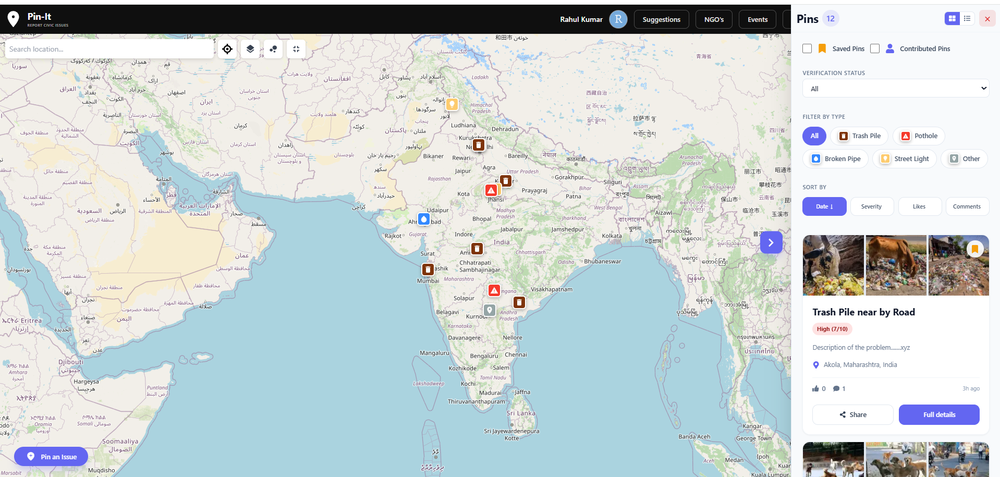
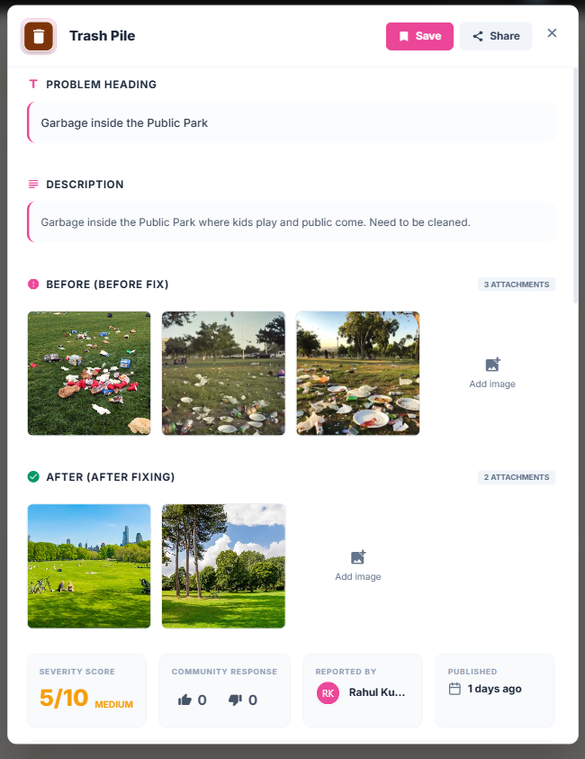
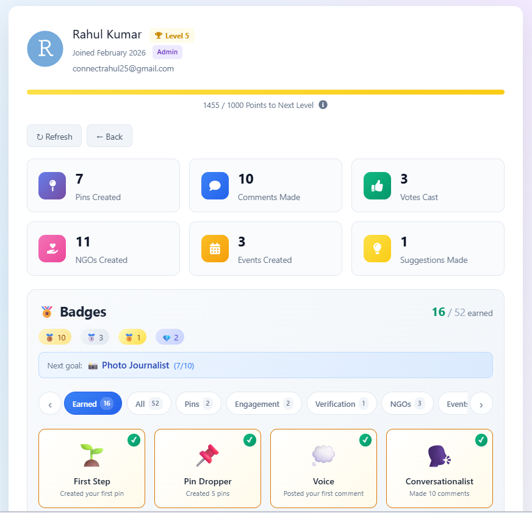
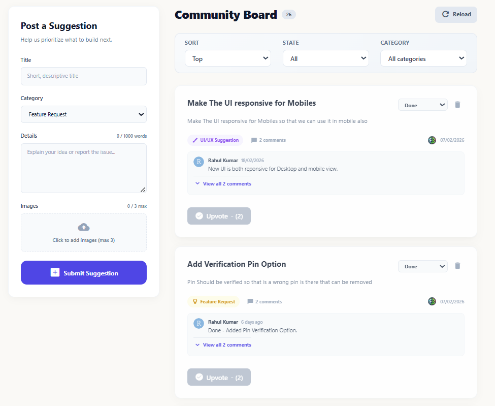
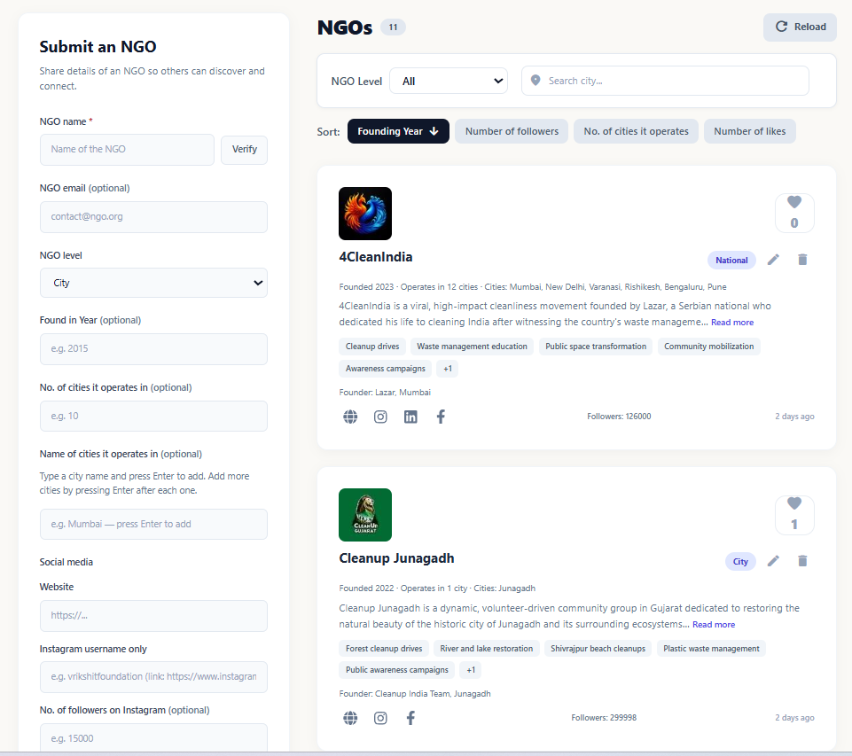
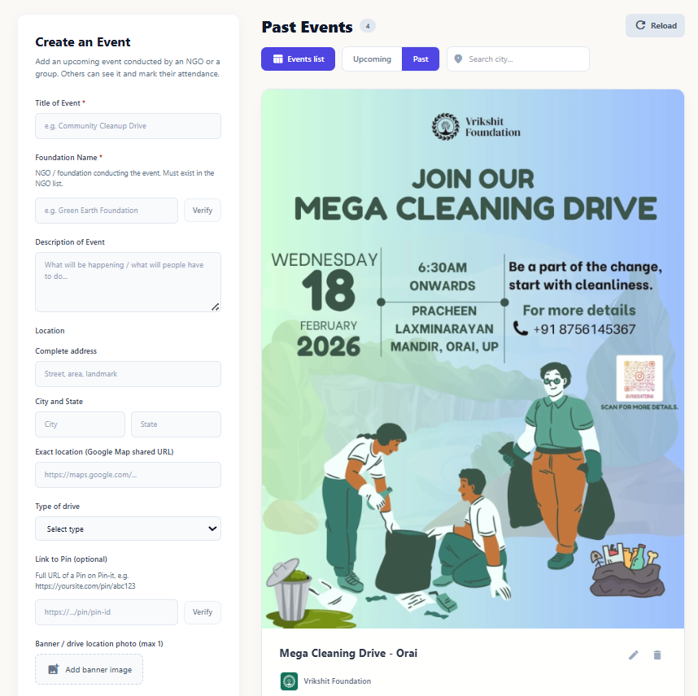
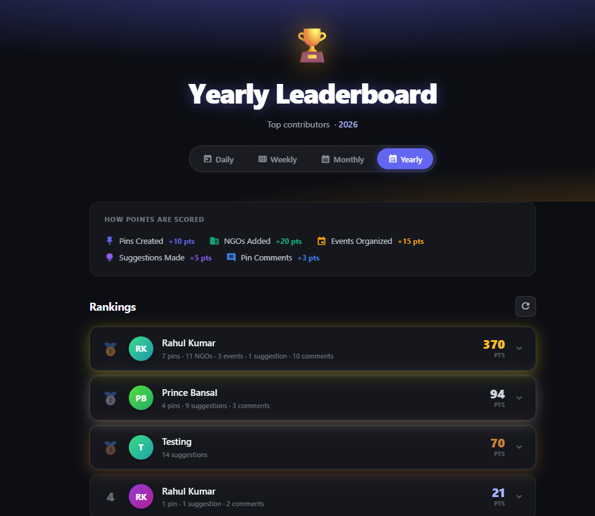
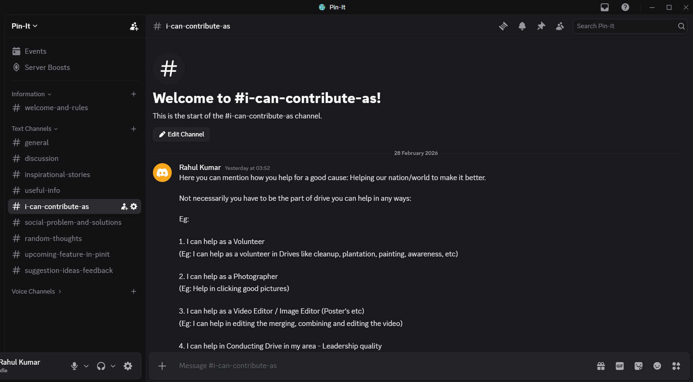

# 📍 Pin-It

> **Pin any civic issue in your locality/surrounding to the map.**

---

## 📋 Table of Contents

- [About Pin-It](#-about-pin-it)
- [Why Pin-It?](#-why-pin-it)
- [Features](#-features)
  - [Map Page](#-map-page)
  - [Pin Details](#-pin-details)
  - [Profile Page](#-profile-page)
  - [Suggestion Page](#-suggestion-page)
  - [NGOs Page](#-ngos-page)
  - [Events Page](#-events-page)
  - [Leaderboard Page](#-leaderboard-page)
  - [Join Discussion](#-join-discord-discord)
  - [Install as App](#-install-as-app)

---

## 🎯 About Pin-It

Pin-It is a civic-issue reporting platform where citizens can drop geo-located pins on a map to report local problems. NGOs and people can then help in fixing these issues.

### Types of Issues You Can Report

| Issue Type | Description |
|------------|-------------|
| 🗑️ Trash Pile | Accumulated garbage in an area |
| 🕳️ Pothole | Road damage and potholes |
| 🌊 Garbage in Water Bodies | Pollution in rivers, lakes, etc. |
| 🐕 Stray Animal Colony | Areas with stray animal issues |
| 💡 Broken Infrastructure | Broken pipes, fuse street lights |
| ➕ And More | Any civic issue in your surroundings |

### How It Works

1. **Drop the pin** on the map
2. **Add details** of the problem
3. **Attach photos** to the pin
4. **Post it** for NGOs and people to see and help

---

## 💡 Why Pin-It?

> **So, this website I made for NGO's and people specific only, not for government specific.**

Government have website as well for reporting issue like that.

**Eg:**
- CPGRAMS (Centralized Public Grievance Redress and Monitoring System): www.pgportal.gov.in
- Swachhata App (MoHUA)
- National Government Services Portal

> *Because, it's not government who is throwing the trash anywhere and causing the litter. It's us who are creating the problem. And so, it's our equal responsibility as well to make surrounding clean.*

> *Once people take part in such drive and work on ground - they will realise how big is the problem. And they will definitely stop doing litter and they will also stop others if to do so. This awareness creates a ripple effect. So, everyone should join the clean-up drives (or other drives) at-least once.*

### The Problem

- Many NGOs conduct drives (cleanups, plantations, painting, etc.) but struggle to find locations
- Low volunteer participation in some cities
- Lack of awareness about ongoing drives

### The Solution

Pin-It helps in:
- ✅ Marking and finding issues nearby
- ✅ Connecting people and NGOs together
- ✅ Fixing problems collaboratively
- ✅ Spreading awareness

### Types of NGO Drives

| Drive Type | Description |
|------------|-------------|
| 🧹 Cleanup Drives | Parks, grounds, rivers, lakes |
| 🌱 Plantation Drives | Tree planting initiatives |
| 🎨 Painting Drives | Removing posters, painting walls/pillars |
| 🕳️ Pothole Fix Drives | Road repair initiatives |
| 📢 Awareness Drives | Spreading awareness about civic issues |

---

## ✨ Features

### 🗺️ Map Page



The main interface for interacting with civic issues.

| Feature | Description |
|---------|-------------|
| **Pin an Issue** | Click the "Pin an Issue" button (bottom-left) to add a new civic issue |
| **View Pins Panel** | Click the arrow "<" on the right to open the side panel listing all pins |
| **Pin Details** | Click on any pin to view full details |
| **Card View Toggle** | Switch between small and large card views |
| **Filters** | Filter pins by type, saved status, date, time, likes, etc. |

---

### 📌 Pin Details




Comprehensive information about each reported issue.

#### Information Displayed

| Field | Description |
|-------|-------------|
| **Heading** | Title of the issue |
| **Description** | Detailed description of the problem |
| **Before Images** | Photos showing the issue (others can add more) |
| **After Images** | Photos showing resolution (others can add more) |
| **Verification Status** | Whether the pin is verified as a genuine issue |
| **Severity** | Scale of 1-10 (low to high) |
| **Likes/Dislikes** | Community engagement metrics |
| **Date of Publish** | When the issue was pinned |
| **Precise Location** | Address, map location, latitude & longitude |

#### Verification System

Pins need a **verification score > 80** to be verified. Different user roles contribute different scores:

| User Role | Verification Score Contribution |
|-----------|-------------------------------|
| 👤 User | 10 points |
| 🔍 Reviewer | 30 points |
| 🏢 NGO | 50 points |
| 👑 Admin | 60 points |

#### Fix Status Workflow

```
📍 Reported → ✅ Verified → ⏳ Awaiting → 📅 Scheduled → ✨ Resolved
```

| Status | Description |
|--------|-------------|
| **Reported** | Initial state when the pin is created |
| **Verified** | Verification score exceeds 80 |
| **Awaiting** | Waiting for an event/drive to be scheduled |
| **Scheduled** | An NGO has scheduled an event for the fix |
| **Resolved** | Issue has been fixed and marked as resolved |

#### Additional Features

- **Mark as Resolved**: Score-based system to verify resolution
- **Comments**: Nested comments up to 3 levels with like, dislike, and reply options

---

### 👤 Profile Page



Track your contributions and achievements.

#### User Statistics

- 📊 Contribution stats
- 🎖️ User role (User, Reviewer, NGO, Admin)
- 📍 Number of pins, events, NGOs, suggestions, comments, likes, etc.

#### Level System

Based on contribution score, users achieve levels (1-5):

| Level | Badge |
|-------|-------|
| Level 1 | 🥉 Bronze |
| Level 2 | 🥈 Silver |
| Level 3 | 🥇 Gold |
| Level 4 | 💎 Platinum |
| Level 5 | 👑 Diamond |

#### Badges Section

Gamification badges to motivate contributions:
- 🏆 Top Contributor
- ⭐ Active Volunteer
- 🌱 Eco Warrior
- *And more...*

#### Contribution Details

- Pins created
- Comments made
- Saved pins
- Suggestions submitted

---

### 💬 Suggestion Page



Share your ideas to improve Pin-It.

#### Suggestion Types

| Type | Description |
|------|-------------|
| 🚀 Feature Request | Request new features |
| 🎨 UI Change | Suggest UI/UX improvements |
| 🐛 Bug Report | Report bugs or issues |
| ⚡ Improvement | General improvement suggestions |

#### Features

- Submit suggestions, feedback, bug reports, and ideas
- Filter suggestions by type and status
- Track action taken on your suggestions

---

### 🏢 NGOs Page



Discover and connect with NGOs.

#### Features

| Feature | Description |
|---------|-------------|
| **Add NGO** | Anyone can add NGO details to expand the database |
| **City Filter** | Filter NGOs by city to find local organizations |
| **Social Media Links** | Connect with NGOs directly |
| **NGO Types** | Find NGOs by focus area (trash, plants, potholes, animals, etc.) |

#### Benefits

- 🤝 Increase NGO database
- 📍 Find NGOs in your city
- 🔗 Facilitate collaboration
- 👥 Gather more volunteers
- 🌍 Create greater impact

---

### 📅 Events Page



Find and share drive events.

#### Problem Solved

Many people want to join NGO drives but aren't aware of events happening in their area.

#### Features

| Feature | Description |
|---------|-------------|
| **Add Events** | Share drive details if you know about upcoming events |
| **Search Database** | Find drives in your city |
| **Date/Time Filter** | Filter by desired date and time |
| **Event Details** | Full information about each drive |

#### Impact

- 📢 Create awareness
- 👥 More people join the cause
- 🗺️ Centralized event database

---

### 🏆 Leaderboard Page



Two sections for recognition and statistics.

#### 🥇 Leaderboard

Top contributors recognized for their efforts.

| Timeframe | Description |
|-----------|-------------|
| Daily | Today's top contributors |
| Weekly | This week's top contributors |
| Monthly | This month's top contributors |
| Yearly | This year's top contributors |

**Purpose:**
- 🎖️ Recognition for contributors
- 🎮 Gamification element
- 💪 Motivation to contribute
- 🎁 Potential rewards for top users

**Scoring:** Each contribution (adding pin, NGO, event, etc.) has a score value. Total score determines ranking.

#### 📊 Platform at a Glance

Pin-It website statistics:

| Metric | Description |
|--------|-------------|
| 👥 Total Users | Users joined Pin-It |
| 🟢 Active Users | Active users this week |
| 📍 Total Pins | Pins created |
| 🏢 Total NGOs | NGOs registered |
| 📅 Total Events | Events created |
| 💡 Total Suggestions | Suggestions submitted |
| ✅ Pins Resolved | Issues fixed |

---

### 💬 Join Discussion (Discord)



Connect with the community!

#### How to Join

Click the **"Join Discussion"** button in the navbar.

#### Discord Channels

| Channel | Purpose |
|---------|---------|
| `#i-can-contribute-as` | Share how you can help (Volunteer, Video Editor, Speaker, Event Organizer, Social Media Handler, etc.) |
| `#useful-info` | Helpful resources and information |
| `#inspirational-stories` | Stories to inspire the community |

#### Purpose

- 📝 Take feedback, suggestions, and ideas
- 🤝 Connect NGOs and people
- 🌱 Grow the community

> *Similar in future will add more useful "#channels" to grow the community and connect more people NGO's and people.*

---

### 📱 Install as App

Pin-It can be installed as a Progressive Web App (PWA).

#### Supported Platforms

| Platform | Support |
|----------|---------|
| 🤖 Android | ✅ Supported |
| 🍎 iOS | ✅ Supported |
| 💻 Windows | ✅ Supported |
| 🍎 Mac | ✅ Supported |

#### How to Install

| Device | Instructions |
|--------|--------------|
| **Mobile** | Tap "Install" button below "Join Discussion" in the navbar |
| **Desktop** | Click the install icon in the browser's address bar |

---

## 🌟 Get Involved

> *"It's our nation and it's our responsibility to make it green and clean."*

Join Pin-It today and be part of the change! 

- 📍 Report issues in your locality
- 🤝 Join NGO drives
- 🌱 Make a difference

---


<div align="center">

**Made with ❤️ for a cleaner, greener tomorrow**

</div>