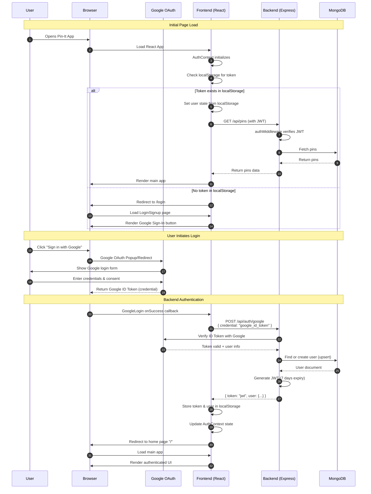
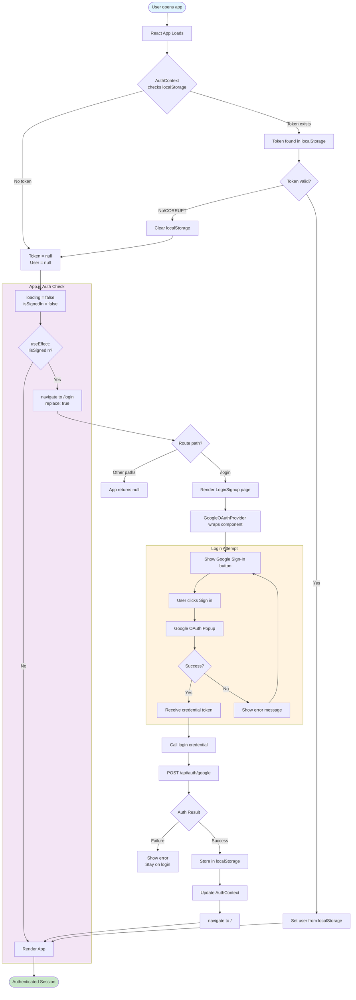
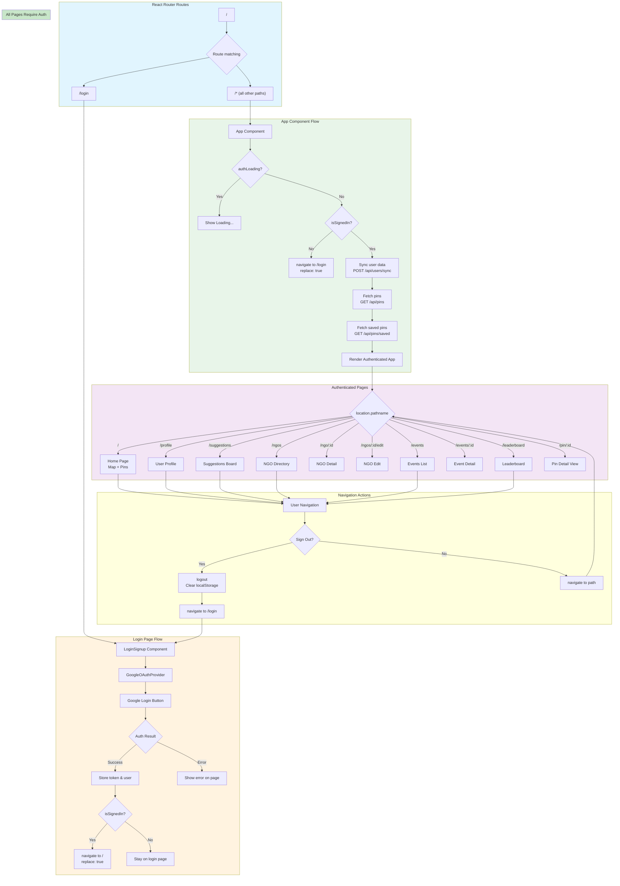

# Pin-It SSO Authentication Flow Diagrams

This document provides comprehensive diagrams explaining how Single Sign-On (SSO) authentication works in the Pin-It application, covering both frontend and backend flows.

---

## Table of Contents

1. [High-Level SSO Authentication Flow](#1-high-level-sso-authentication-flow)
2. [Unauthenticated User Flow](#2-unauthenticated-user-flow)
3. [Authenticated User Flow](#3-authenticated-user-flow)
4. [Backend Route Protection Architecture](#4-backend-route-protection-architecture)
5. [Token Lifecycle](#5-token-lifecycle)
6. [Page Navigation & Redirect Flow](#6-page-navigation--redirect-flow)

---

## 1. High-Level SSO Authentication Flow

This diagram shows the complete user journey from landing on the app to successful authentication.



---

## 2. Unauthenticated User Flow

This diagram shows what happens when an unauthenticated user tries to access protected routes.



---

## 3. Authenticated User Flow

This diagram shows how authenticated users make API calls with JWT tokens.

```mermaid
flowchart TD
    subgraph Frontend ["Frontend (React)"]
        Start([User Action]) --> Action[User performs action<br/>e.g., create pin, save pin]
        Action --> GetToken[authFetch calls getToken]
        GetToken --> ReadToken[Read token from localStorage]
        ReadToken --> AddHeader[Add Authorization header<br/>Bearer {token}]
    end
    
    subgraph Network ["HTTP Request"]
        AddHeader --> Request[API Request to Backend<br/>Authorization: Bearer jwt_token]
    end
    
    subgraph Backend ["Backend (Express)"]
        Request --> RateLimit[General Rate Limiter]
        RateLimit --> AuthMiddleware[authMiddleware]
        
        AuthMiddleware --> ExtractToken[Extract Bearer token<br/>from Authorization header]
        ExtractToken --> VerifyJWT{JWT.verify token}
        
        VerifyJWT -->|Invalid/Missing| Return401[Return 401 Unauthorized<br/>{ error: "Unauthorized" }]
        VerifyJWT -->|Expired| Return401Expired[Return 401<br/>{ error: "Invalid or expired token" }]
        VerifyJWT -->|Valid| DecodeToken[Decode token<br/>Extract userId]
        
        DecodeToken --> SetReqAuth[Set req.auth = { userId }]
        SetReqAuth --> RouteHandler[Route Handler]
        
        RouteHandler --> BusinessLogic[Business Logic]
        BusinessLogic --> DBQuery[Database Query/Update]
    end
    
    subgraph Database ["MongoDB"]
        DBQuery --> MongoOp[MongoDB Operation]
        MongoOp --> DBResult[Result]
    end
    
    subgraph Response ["Response"]
        DBResult --> SuccessResponse[Return JSON response]
        SuccessResponse --> FrontendReceive[Frontend receives data]
        FrontendReceive --> UpdateUI[Update UI / State]
    end
    
    Return401 --> HandleError[Frontend handles error]
    Return401Expired --> HandleError
    HandleError --> CheckError{Error type?}
    CheckError -->|401 Unauthorized| LogoutUser[Logout user<br/>Clear localStorage]
    CheckError -->|Other errors| ShowErrorMsg[Show error message]
    
    LogoutUser --> RedirectToLogin[Redirect to /login]
    
    UpdateUI --> End([Complete])
    ShowErrorMsg --> End
    RedirectToLogin --> LoginEnd([Back to Login])

    style Start fill:#e1f5fe
    style End fill:#c8e6c9
    style LoginEnd fill:#ffcdd2
    style Frontend fill:#e3f2fd
    style Backend fill:#fff8e1
    style Database fill:#f3e5f5
```

---

## 4. Backend Route Protection Architecture

This diagram shows which routes are public vs protected and how middleware chains work.

```mermaid
flowchart TB
    subgraph Client ["Client Request"]
        Request([Incoming HTTP Request])
    end
    
    subgraph Middleware ["Express Middleware Chain"]
        Request --> CORS[cors middleware<br/>Check CORS_ORIGIN]
        CORS --> JSON[express.json parser]
        JSON --> TrustProxy[trust proxy setting]
        TrustProxy --> Logger[requestLogger middleware]
    end
    
    subgraph Routing ["Route Routing"]
        Logger --> HealthCheck{Path == /api/health?}
        HealthCheck -->|Yes| HealthResponse[Return 200 OK<br/>{ status: "OK" }]
        
        HealthCheck -->|No| ImageUpload{Path == /api/images/upload?}
        ImageUpload -->|Yes| UploadRateLimit[uploadRateLimiter]
        UploadRateLimit --> AuthMiddleware1[authMiddleware]
        
        ImageUpload -->|No| AuthRoute{Path == /api/auth/*?}
        AuthRoute -->|Yes| AuthRateLimit[authRateLimiter]
        AuthRateLimit --> AuthRoutes[Auth Routes<br/>POST /google]
        
        AuthRoute -->|No| GeneralRateLimit[generalRateLimiter]
        GeneralRateLimit --> AuthCheck{Has Valid JWT?}
        
        AuthCheck -->|No| Return401[Return 401 Unauthorized]
        AuthCheck -->|Yes| ProtectedRoutes[Protected API Routes]
    end
    
    subgraph Protected ["Protected Routes (Require JWT)"]
        ProtectedRoutes --> Users[/api/users]
        ProtectedRoutes --> Pins[/api/pins]
        ProtectedRoutes --> Comments[/api/comments]
        ProtectedRoutes --> Votes[/api/votes]
        ProtectedRoutes --> Images[/api/images]
        ProtectedRoutes --> Suggestions[/api/suggestions]
        ProtectedRoutes --> NGOs[/api/ngos]
        ProtectedRoutes --> Events[/api/events]
        ProtectedRoutes --> Leaderboard[/api/leaderboard]
    end
    
    subgraph Public ["Public Routes (No JWT Required)"]
        HealthResponse --> PublicEnd([Public Response])
        AuthRoutes --> PublicEnd
    end
    
    subgraph Responses ["Responses"]
        Users --> APIResponse[JSON Response]
        Pins --> APIResponse
        Comments --> APIResponse
        Votes --> APIResponse
        Images --> APIResponse
        Suggestions --> APIResponse
        NGOs --> APIResponse
        Events --> APIResponse
        Leaderboard --> APIResponse
        
        Return401 --> ErrorResponse[Error Response]
        UploadRateLimit --> RateLimitResponse[Rate Limit Response<br/>429 Too Many Requests]
    end
    
    APIResponse --> End([Client receives response])
    ErrorResponse --> End
    PublicEnd --> End
    RateLimitResponse --> End

    style Request fill:#e1f5fe
    style Protected fill:#c8e6c9
    style Public fill:#fff9c4
    style Return401 fill:#ffcdd2
```

### Route Protection Summary Table

| Route Path | Protection | Rate Limiting | Notes |
|------------|------------|---------------|-------|
| `GET /api/health` | ❌ Public | None | Health check endpoint |
| `POST /api/auth/google` | ❌ Public | `authRateLimiter` (strict) | Google OAuth login |
| `POST /api/images/upload` | ✅ Protected | `uploadRateLimiter` | Image upload to Cloudinary |
| `/api/users/*` | ✅ Protected | `generalRateLimiter` | User profile operations |
| `/api/pins/*` | ✅ Protected | `generalRateLimiter` | Pin CRUD operations |
| `/api/comments/*` | ✅ Protected | `generalRateLimiter` | Comments on pins |
| `/api/votes/*` | ✅ Protected | `generalRateLimiter` | Voting on pins |
| `/api/suggestions/*` | ✅ Protected | `generalRateLimiter` | Feature suggestions |
| `/api/ngos/*` | ✅ Protected | `generalRateLimiter` | NGO directory |
| `/api/events/*` | ✅ Protected | `generalRateLimiter` | Events management |
| `/api/leaderboard/*` | ✅ Protected | `generalRateLimiter` | Leaderboard data |

---

## 5. Token Lifecycle

This diagram shows how JWT tokens are created, stored, used, and validated throughout their lifecycle.

```mermaid
flowchart LR
    subgraph Creation ["1. Token Creation"]
        GoogleToken[Google ID Token] --> Backend[Backend receives<br/>credential]
        Backend --> Verify[Verify with<br/>Google OAuth2Client]
        Verify --> UserDoc[Find/Create user<br/>in MongoDB]
        UserDoc --> JWTSign[jwt.sign<br/>userId + JWT_SECRET<br/>expiresIn: 7d]
        JWTSign --> NewToken[New JWT Token]
    end
    
    subgraph Storage ["2. Token Storage (Frontend)"]
        NewToken --> Response[Backend Response<br/>{ token, user }]
        Response --> LoginFunc[AuthContext.login]
        LoginFunc --> LocalStorage[localStorage.setItem<br/>pinit_token<br/>pinit_user]
        LocalStorage --> StateUpdate[Update React state<br/>token, user]
    end
    
    subgraph Usage ["3. Token Usage"]
        StateUpdate --> AuthFetch[authFetch function]
        LocalStorage --> GetToken[getToken reads<br/>localStorage]
        GetToken --> AuthFetch
        AuthFetch --> AddHeader[Add Authorization header<br/>Bearer {token}]
        AddHeader --> APIRequest[API Request to Backend]
    end
    
    subgraph Validation ["4. Token Validation (Backend)"]
        APIRequest --> Middleware[authMiddleware]
        Middleware --> ExtractBearer[Extract Bearer token<br/>from header]
        ExtractBearer --> JWTVerify[jwt.verify<br/>JWT_SECRET]
        
        JWTVerify --> ValidToken{Token Valid?}
        ValidToken -->|Yes| SetReqAuth[req.auth = { userId }]
        ValidToken -->|No/Expired| Return401[Return 401<br/>Invalid/Expired]
        
        SetReqAuth --> Continue[Continue to route handler]
    end
    
    subgraph Expiry ["5. Token Expiry & Refresh"]
        Continue --> APIResponse[API Response]
        APIResponse --> CheckExpiry{Token expired?<br/>7 days}
        
        CheckExpiry -->|No| ContinueUsage[Continue using token]
        CheckExpiry -->|Yes| APIFails[API returns 401]
        
        APIFails --> HandleExpiry[Frontend handles 401]
        HandleExpiry --> Logout[Logout user<br/>Clear localStorage]
        Logout --> RedirectToLogin[Redirect to /login]
        RedirectToLogin --> Reauth[User re-authenticates]
        Reauth --> GoogleToken
    end
    
    subgraph Logout ["6. Manual Logout"]
        UserLogout[User clicks Sign out] --> ClearLocal[Clear localStorage<br/>pinit_token<br/>pinit_user]
        ClearLocal --> ResetState[Reset AuthContext<br/>token = null<br/>user = null]
        ResetState --> NavigateLogin[navigate to /login]
    end

    style Creation fill:#e3f2fd
    style Storage fill:#e8f5e9
    style Usage fill:#fff3e0
    style Validation fill:#fce4ec
    style Expiry fill:#f3e5f5
    style Logout fill:#ffebee
```

### Token Details

| Property | Value | Description |
|----------|-------|-------------|
| **Token Type** | JWT (JSON Web Token) | Industry-standard for stateless auth |
| **Signing Algorithm** | HS256 | HMAC with SHA-256 |
| **Secret** | `JWT_SECRET` (from .env) | Must be 32+ characters, kept secret |
| **Payload** | `{ userId: "google_sub" }` | Google's unique user ID |
| **Expiry** | 7 days | Configured in `jwt.sign()` |
| **Storage** | localStorage | Keys: `pinit_token`, `pinit_user` |

---

## 6. Page Navigation & Redirect Flow

This diagram shows all pages in the application and their authentication requirements.



### Page Authentication Requirements

| Page | Path | Auth Required | Redirect if Unauthenticated |
|------|------|---------------|----------------------------|
| Login | `/login` | ❌ No | N/A (this is the login page) |
| Home | `/` | ✅ Yes | `/login` |
| Profile | `/profile` | ✅ Yes | `/login` |
| Suggestions | `/suggestions` | ✅ Yes | `/login` |
| NGOs | `/ngos` | ✅ Yes | `/login` |
| NGO Detail | `/ngo/:id` | ✅ Yes | `/login` |
| NGO Edit | `/ngos/:id/edit` | ✅ Yes | `/login` |
| Events | `/events` | ✅ Yes | `/login` |
| Event Detail | `/events/:id` | ✅ Yes | `/login` |
| Leaderboard | `/leaderboard` | ✅ Yes | `/login` |
| Pin Detail | `/pin/:id` | ✅ Yes | `/login` |

---

## Summary

### Key Authentication Flow Points

1. **Initial Load**: App checks localStorage for existing token
2. **No Token**: Redirect to `/login` page
3. **Google OAuth**: User authenticates with Google, receives ID token
4. **Backend Verification**: Backend verifies Google token, creates JWT
5. **Token Storage**: Frontend stores JWT in localStorage
6. **API Calls**: All API calls include JWT in Authorization header
7. **Token Validation**: Backend middleware validates JWT on every protected request
8. **Token Expiry**: After 7 days, user must re-authenticate
9. **Logout**: Clears localStorage and redirects to login

### Security Considerations

- **Rate Limiting**: Auth routes have strict rate limiting to prevent brute force
- **CORS**: Only allowed origins can make requests
- **JWT Secret**: Must be kept secret and be sufficiently long (32+ chars)
- **Token Expiry**: 7-day expiry limits window of vulnerability
- **HTTPS**: Should be used in production to protect token in transit